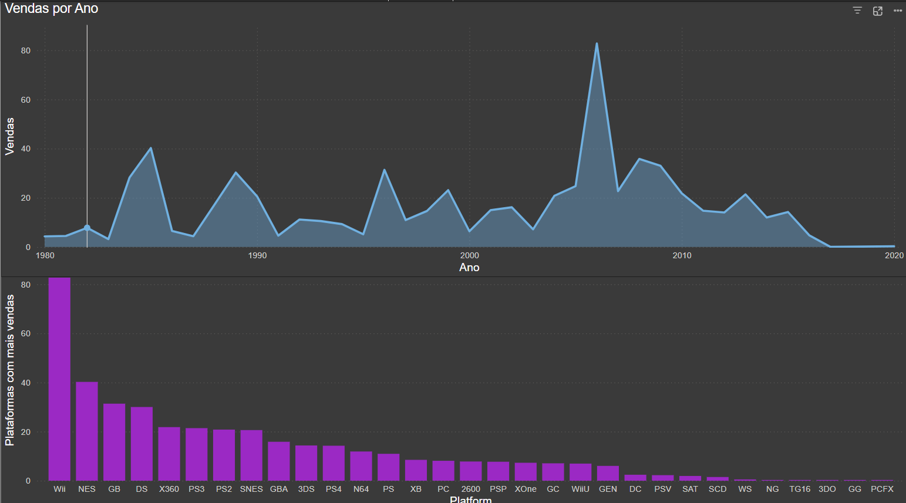
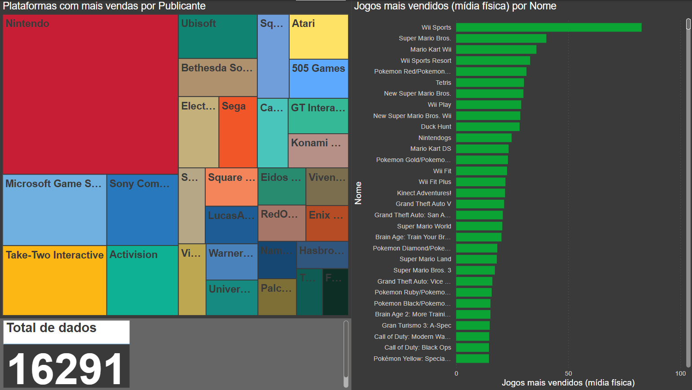

# 📊 Análise de Vendas de Jogos – Storytelling

## 🎮 Introdução
O mercado de videogames movimenta bilhões de dólares anualmente, com plataformas e jogos dominando diferentes períodos da história. A análise a seguir explora o comportamento das vendas ao longo dos anos, as plataformas mais bem-sucedidas e os jogos mais vendidos no mercado físico. Para acessar a explicação da tratativa dos dados localizados no caminho `archive/vgsales.csv`, basta clicar [aqui](https://github.com/viivi02/Analise-jogos/blob/05f9f31f708316ccbec2d881f0b14743ab6d5e8a/TratativaDados.md) e acessar a documentação sobre.

---

## 🔍 **Vendas ao Longo dos Anos**
O primeiro gráfico exibe a evolução das vendas de jogos desde os anos 1980. Observamos:

- **Picos de vendas significativos** nos anos 2000, com um destaque especial por volta de 2008-2009.
- **Oscilações marcantes** ao longo dos anos, indicando momentos de crescimento e quedas.
- **Tendência de declínio a partir de 2015**, possivelmente refletindo a transição para mídias digitais e novos modelos de negócios, como jogos por assinatura e serviços na nuvem.

---

## 🏆 **Plataformas com Mais Vendas**
O segundo gráfico em barras evidencia as plataformas mais lucrativas da indústria. Os principais destaques:

- **Nintendo Wii lidera as vendas**, seguido por NES e Game Boy, mostrando a força da Nintendo no mercado.
- **Plataformas modernas como X360, PS3 e PS4** também aparecem com destaque, reforçando o domínio da Sony e Microsoft nas últimas décadas.
- **Plataformas clássicas (SNES, N64, PS2)** mantêm um forte histórico de vendas.

---

## 🎭 **Plataformas por Publicantes**
O gráfico de árvore apresenta os principais publishers responsáveis pelas maiores vendas em suas respectivas plataformas. Destaques:

- **Nintendo domina**, sendo a publicadora mais relevante em termos de vendas.
- **Microsoft, Sony, Ubisoft, Take-Two Interactive e Activision** também aparecem como grandes players do mercado.
- **Diversidade de empresas** atuando no setor, com algumas especializadas em franquias icônicas.

---

## 🏅 **Top Jogos Mais Vendidos (Mídia Física)**
O gráfico de barras revela os jogos físicos mais vendidos da história. Entre eles:

- **"Wii Sports" lidera com folga**, impulsionado pelo fato de ter sido incluído como bundle no console.
- **Franquias da Nintendo** como Super Mario, Pokémon e Mario Kart dominam a lista.
- **GTA V e GTA: San Andreas** representam os jogos da Rockstar como best-sellers fora do ecossistema Nintendo.
- **Call of Duty** e **Gran Turismo** também marcam presença como franquias de sucesso.

---

## 📌 **Conclusões**
- A **Nintendo continua sendo uma das maiores influências na indústria**, com seus consoles e jogos dominando as vendas históricas.
- O mercado de jogos teve **grandes picos de crescimento nos anos 2000**, mas a partir de 2015 vemos uma desaceleração.
- A **migração para o digital** pode ter impactado as vendas físicas, alterando a forma como os consumidores adquirem jogos.
- **Títulos clássicos continuam relevantes**, mostrando que franquias fortes mantêm um apelo duradouro.

🔮 **Futuro do Mercado:** O setor pode continuar mudando com novos modelos de negócios, como jogos por assinatura, streaming e realidade virtual. Acompanhar essas tendências será essencial para entender os próximos passos da indústria!

---

🚀 **Essa é uma análise simples que ajuda a entender as dinâmicas do mercado e como as estratégias das empresas moldaram o sucesso de diferentes plataformas e jogos ao longo dos anos. Dentro deste repositório está o arquivo que foi feita a tratativa dos dados do csv junto ao arquivo do Power BI**

- [Arquivo Power BI](https://github.com/viivi02/Analise-jogos/blob/4f45906d37076adc5e02b1bd66a669b8648e6698/Analise%20jogos.pbix)
- [Arquivo em Jupyter notebook para tratativa de dados](https://github.com/viivi02/Analise-jogos/blob/4f45906d37076adc5e02b1bd66a669b8648e6698/Tratamento.ipynb)
- [Versão Final CSV](https://github.com/viivi02/Analise-jogos/blob/4f45906d37076adc5e02b1bd66a669b8648e6698/vgsales.csv)
